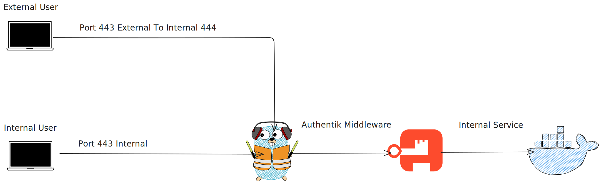

# Authentik Docker Compose

## Overview
Working Authentik configuration behind Traefik.

## Prerequisites
* Docker + Docker Compose
* External network: `proxy`
* NFS mounts for persistence
* DNS record for `authentik.local.domain.com` pointing to host

## Architecture

*This diagram illustrates the flow of authentication for both external and internal users through Authentik Middleware to the internal service.*

## Configuration

### Files
* `compose.yaml`: Main configuration
* `.env.example`: Example environment file (rename to `.env` and update with your values)

### Volumes
* PostgreSQL data: Docker volume `database`
* Redis data: Docker volume `redis`
* Authentik data: NFS mounts
  - `/nfs/apps/authentik/media`
  - `/nfs/apps/authentik/certs`
  - `/nfs/apps/authentik/custom-templates`

### Network
Uses external `proxy` network for Traefik integration

## Traefik Integration
* Server exposed via Traefik on HTTPS
* Configured for automatic SSL/TLS through Traefik
* Access at: `https://authentik.local.domain.com`

## Deployment
```bash
docker compose up -d