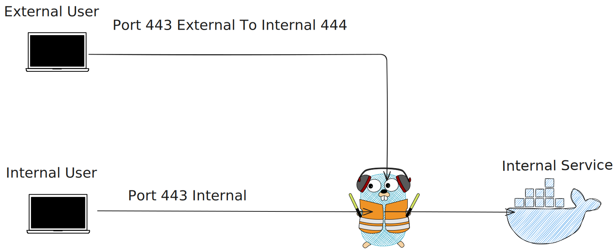

# Traefik Docker Compose

## Architecture

*Diagram showing dual entry points: External users connect via port 443→444, while internal users access directly via port 443. Both routes are managed by Traefik (center) to reach internal Docker services.*

## Why Dual Entrypoints?

* **Security Segmentation**: Separates external (untrusted) from internal (trusted) traffic
* **Independent Routing**: Some services can be exclusively internal only

## Goal
Traefik Docker provider with Ports 80/443 (internal) + optional 81/444 (external).

## Requires
* Docker + Docker Compose
* Cloudflare API Token (DNS Edit/Read Perms)
* Network: `docker network create proxy`
* Host dir for persistent data (e.g., `./traefik-data`)
* DNS pointing to host IP

## Files Needed
1. **In Host Dir (`./traefik-data`):**
   * `traefik.yml`: Configure entrypoints (http, https, http-external, https-external), docker provider (network: proxy), cert resolver (`cloudflare`, storage: `/acme.json`, email). 
   * `acme.json`: `touch ./traefik-data/acme.json && chmod 600 ./traefik-data/acme.json`
   * `cf_api_token.txt`: Paste Cloudflare Token string here.
2. **Next to `docker-compose.yml`:**
   * `.env`: `TRAEFIK_DASHBOARD_CREDENTIALS=$(htpasswd -nb user password)`

## Action
* **MUST:** Edit `docker-compose.yml` volume host paths and `secrets.cf_api_token.file` path to match your chosen host dir (e.g., `./traefik-data`).

## Run
```bash
docker-compose up -d 
```

## Notes
* Healthchecks configured for all services
* This is a tested, working configuration serving as reference